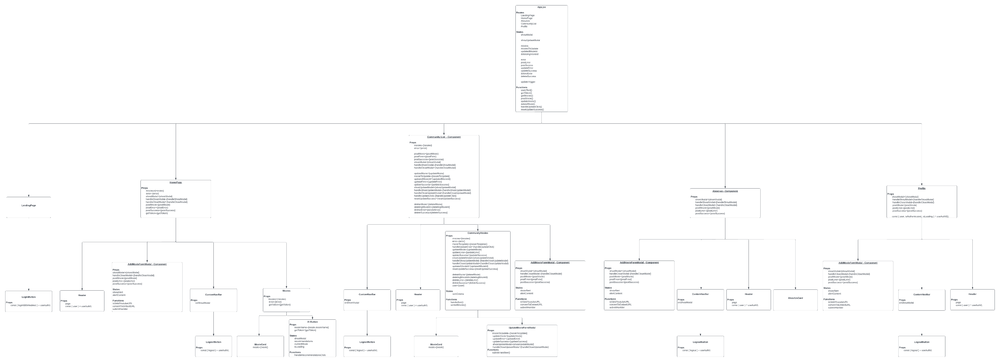
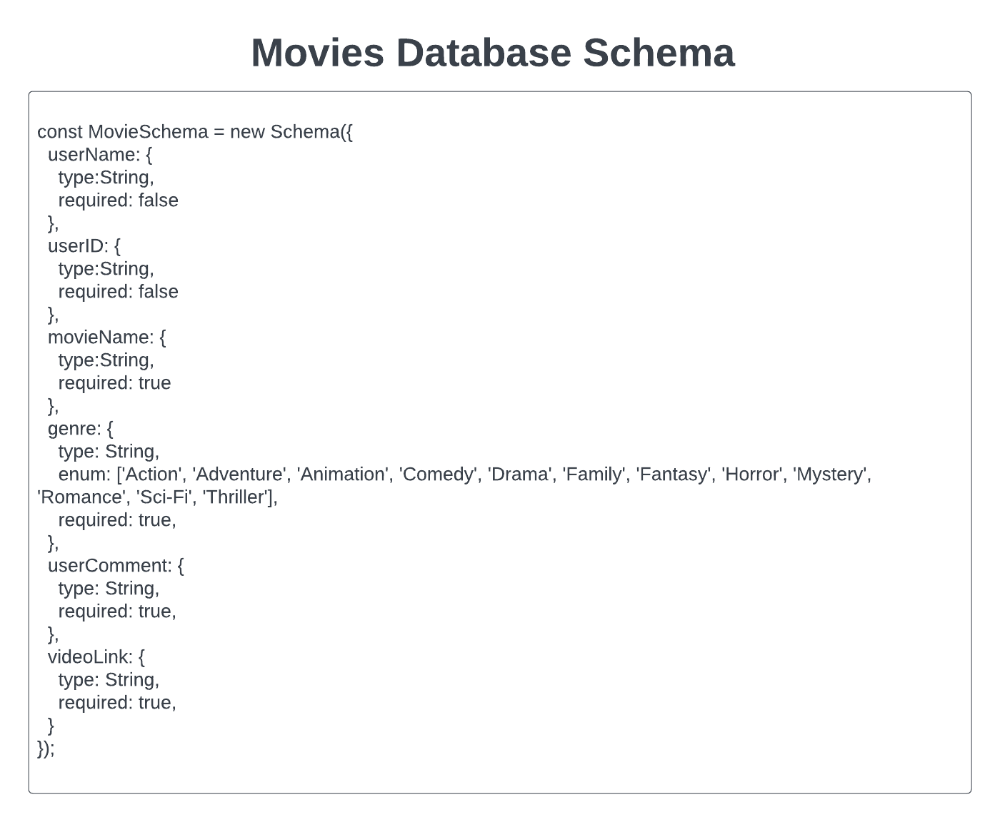
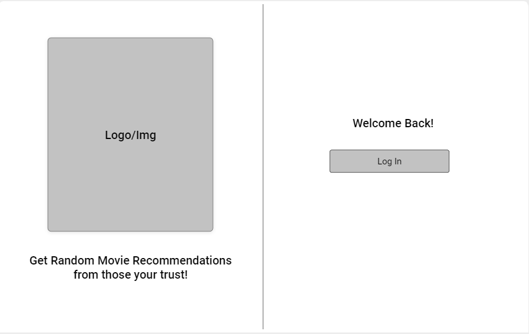
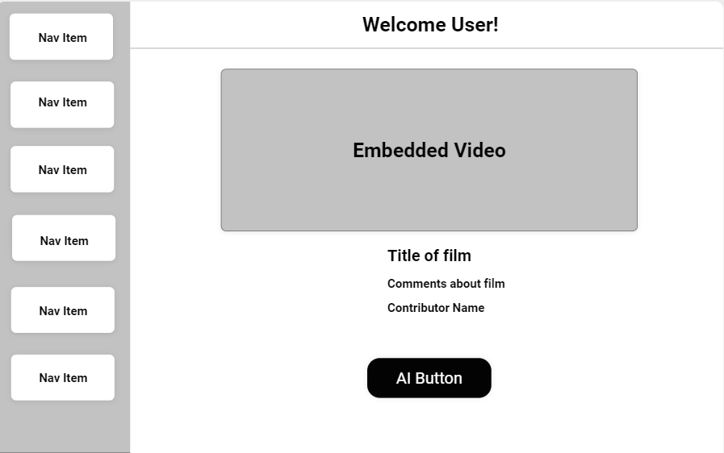
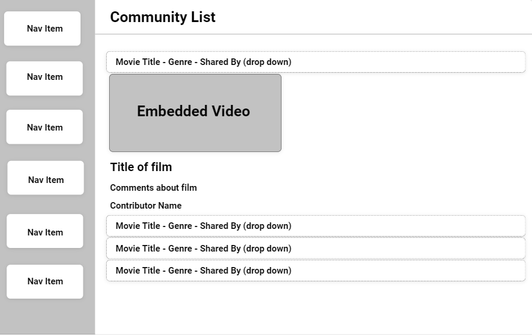
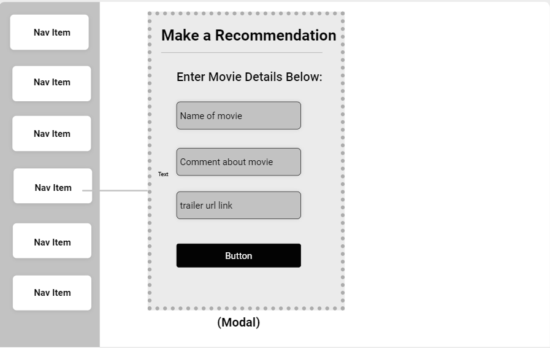
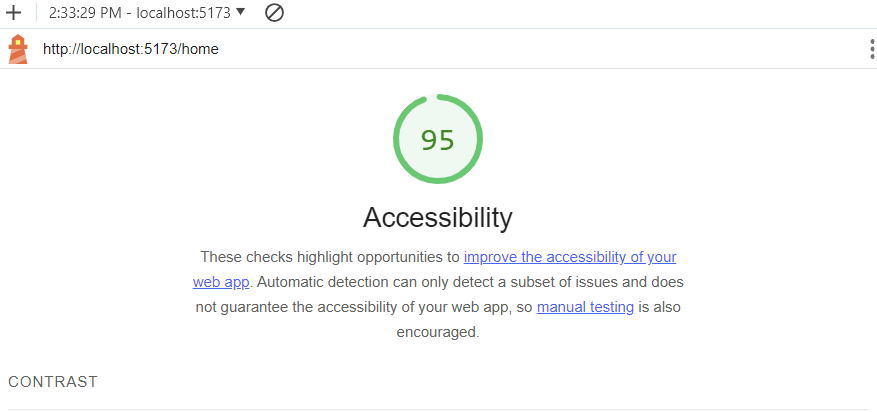

# WWYR - Back-end

## Team Member(s)

Melo "Melodic" Gonzalez

## Description

Provide users with movie recommendations (complete with YouTube trailer, contributor details, and comments about the movie) from individuals the user knows and trusts. Users will have access to a curated selection of movies handpicked by their own community. Users value personal recommendations when it comes to deciding what movie to watch.

## Getting Started

### Requirements

For development, you will only need Node.js installed on your environment.
And please use the appropriate [Editorconfig](http://editorconfig.org/) plugin for your Editor (not mandatory).

#### Node

[Node](http://nodejs.org/) is really easy to install & now include [NPM](https://npmjs.org/).
You should be able to run the following command after the installation procedure
below.

    $ node --version
    v0.10.24

    $ npm --version
    1.3.21

### Install

    git clone https://github.com/ORG/PROJECT.git
    cd PROJECT
    npm install

### Configure app

Any environment configuration steps.

### Start & watch

    npm run dev
    npm start

### Simple build for production

    npm run build

## Architecture

### Languages & tools

JavaScript, Axios, Mongoose, MongoDB, Cors, Dotenv, Express, Jsonwebtoken, jwks-rsa, openai

## Change Log

### 12-13-2023

12-13-2023 2:20pm - Send back user ID in data

Name of feature: Modification, send back user ID in data instead of email

Estimate of time needed to complete: 1 hour

Actual time needed to complete: 4 hours

12-8-2023 8:00am - Authenticate user before executing CRUD requests

Name of feature: Authorize user before executing CRUD requests

Estimate of time needed to complete: 1 hour

Actual time needed to complete: 1 hour

### 12-8-2023

12-8-2023 2:20pm - Open AI API call with prompt

Name of feature: Open AI API call with prompt

Estimate of time needed to complete: 1 hour

Actual time needed to complete: 4 hours

12-8-2023 8:00am - Authenticate user before executing CRUD requests

Name of feature: Authorize user before executing CRUD requests

Estimate of time needed to complete: 1 hour

Actual time needed to complete: 1 hour

### 11-29-2023 thru 11-30-2023

11-29-2023 - 11-30-2023 9:15am - Set up basic CRUD routes

Name of feature: Set up basic CRUD routes

Estimate of time needed to complete: 2 hours

Start time: 9:30 am

Finish time: 10:30 am

Start time: 8:00 am

Finish time: 9:15 am

Actual time needed to complete: 2 hours

11-29-2023 9:30am - Application now has successful connection to MongoDB using Mongoose.

Name of feature: Set up back-end to connect to MongoDB using Mongoose

Estimate of time needed to complete: 2 hours

Start time: 8:30 am

Finish time: 9:30 am

Actual time needed to complete: 1 hr

## Links

### GitHub Project Management Board

[GitHub Project Management Board](https://github.com/orgs/WWYR-Community-Movie-Recommendations/projects/2/views/1)  

### Domain Model (image)

### Database Schema (image)

### WireFrames (images)

  

  

  

### Team Agreement

[Team Agreement](TeamAgreement.md)

### Lighthouse Scores

LightHouse Score 11-07-2023 
